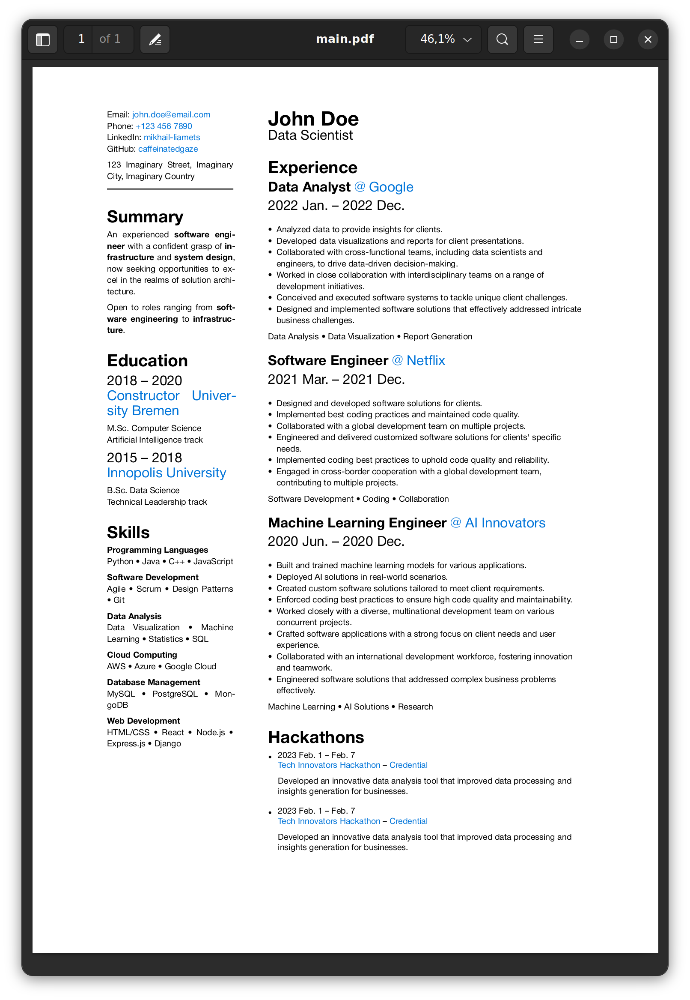

# Bare-bones Typst CV



To generate `main.pdf` and watch for live changes, run

`typst watch main.typ`

```bash
________ Main content
├── main.typ
├── settings.yaml      # Spacing and font sizes
└── configuration.yaml # Content

________ Auxilary
├── README.md
├── main.pdf
└── images
   └── example.png
```
